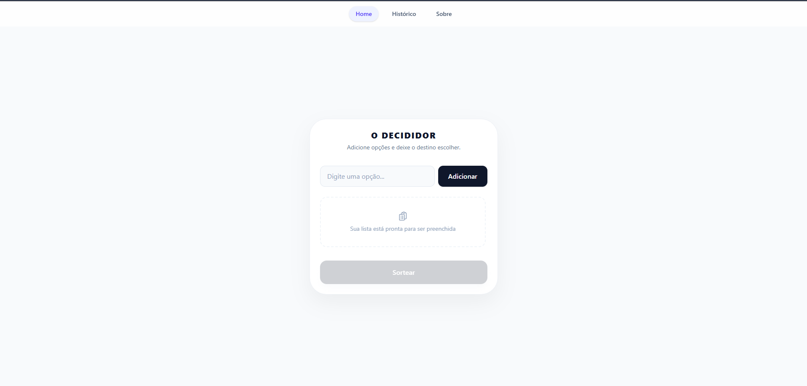
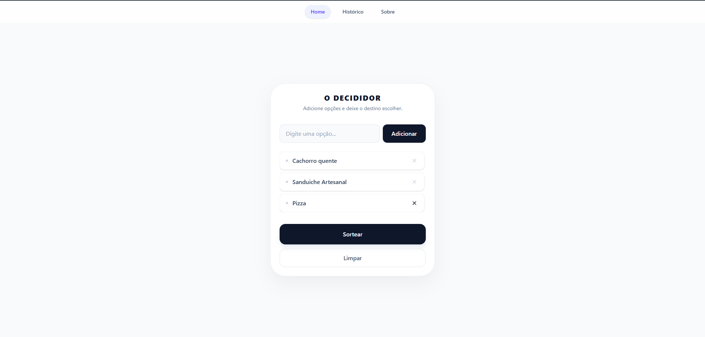
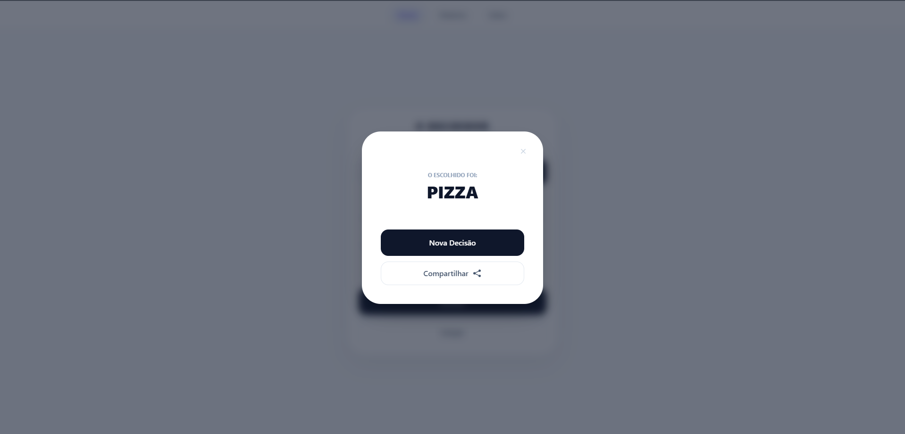
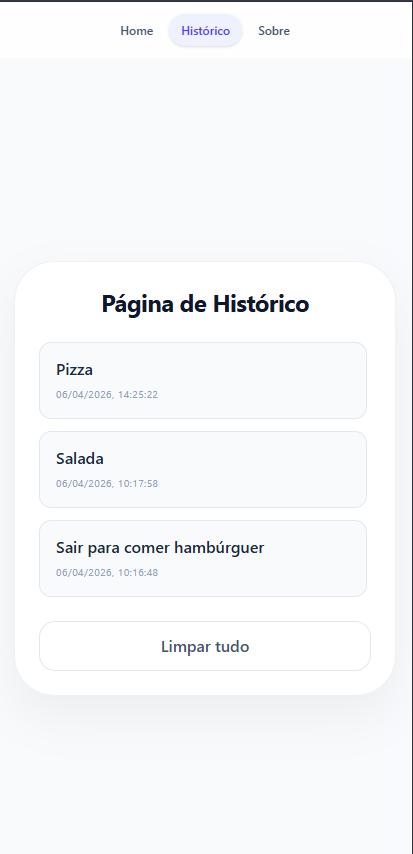

# O Decididor 🎯

Sabe quando você pergunta "o que vamos comer?" e a resposta é sempre "não sei", "qualquer coisa" ou "escolhe você"? Criei esse app pra acabar com esse impasse de casal e de grupo de amigos. A ideia é simples: você joga as opções lá e deixa a sorte decidir. Assim, ninguém fica com o peso de ter que escolher sozinho.

🔗 **[Acesse o App Online Aqui](https://o-decididor.vercel.app/)**

---

  
  
  
  

---

## O que usei no projeto:

Em vez de só fazer o básico, aproveitei pra configurar um ambiente de trabalho que fosse organizado, do jeito que o mercado usa:

- **React + Vite:** Pra deixar o site rápido e leve.
- **Tailwind CSS:** Pra fazer o visual na mão, sem usar componentes prontos.
- **React Router:** Pra navegar entre as telas sem aquele carregamento chato de página.
- **SVG (Heroicons):** Em vez de instalar bibliotecas pesadas de ícones, coloquei os códigos direto pra manter o projeto leve.
- **ESLint e Prettier:** Pra manter o meu código limpo e padronizado enquanto eu estudava.
- **Compartilhamento WhatsApp:** Utilizei uma URL para compartilhar o resultado diretamente pelo WhatsApp.

---

## Desafios Técnicos

Essa foi a parte mais importante do meu aprendizado neste projeto:

1. **Configuração ESLint + Prettier:** O maior desafio técnico foi a configuração e o entendimento dos erros que apareciam no console. Algumas vezes eram erros simples, como variáveis não utilizadas ou fechamento de tags. Porém, tive dois erros que não entendia o motivo: o `react/prop-types` e o `react/no-unescaped-entities`. O primeiro trata de props não declaradas (resolvi de forma paliativa para não instalar bibliotecas extras no momento) e o outro é sobre o uso de caracteres especiais. Entendi que o ESLint identifica aspas e sinais como `>`, `<` e os interpreta como fora de contexto ou duplicados, então a solução foi simples: utilizar aspas simples ou entidades HTML para o texto.

2. **Refatorar e transformar em Componentes:** Notei que estava repetindo muito código em elementos como cards e botões. Então, transformei esses itens em componentes para facilitar a leitura e a manutenção, assim como criei um arquivo de ícones separado para organizar melhor o projeto.

---

## Como rodar na sua máquina:

**Clone o projeto**

`git clone https://github.com/Felipe-C-Gonzalez/o-decididor.git`

**Entre na pasta**

`cd o-decididor`

**Instale as dependências**

`npm install`

**Rode o projeto**

`npm run dev`

---

## Desenvolvido por
**Felipe C. Gonzalez**

- [LinkedIn](https://linkedin.com/in/felipecgonzalez)
- [GitHub](https://github.com/Felipe-C-Gonzalez)

---

_Projeto desenvolvido para fins de estudo e prática de desenvolvimento Frontend._